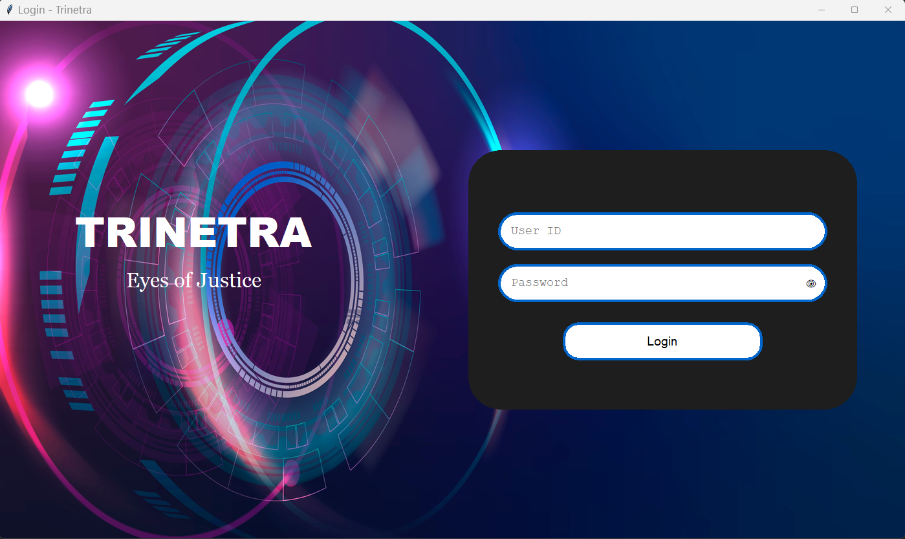
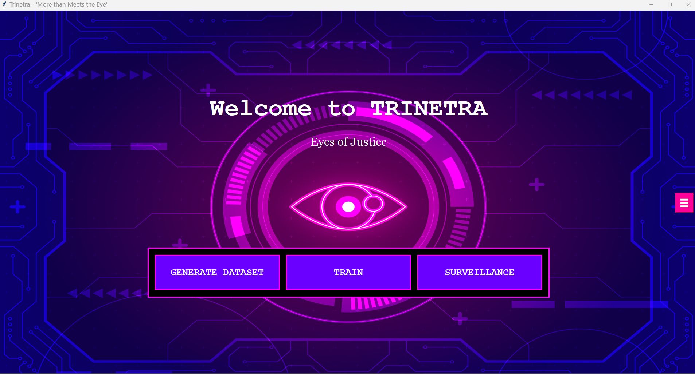
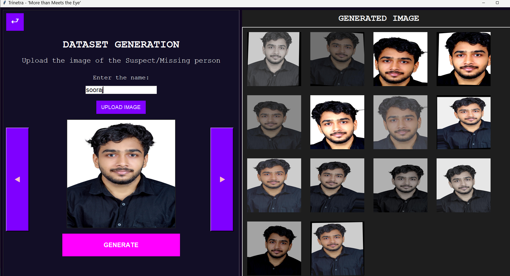
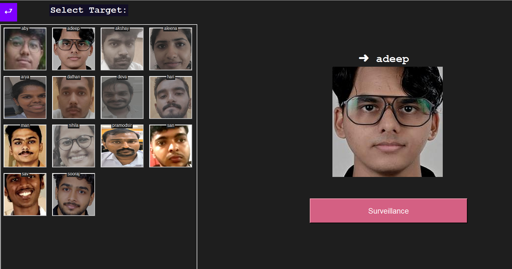
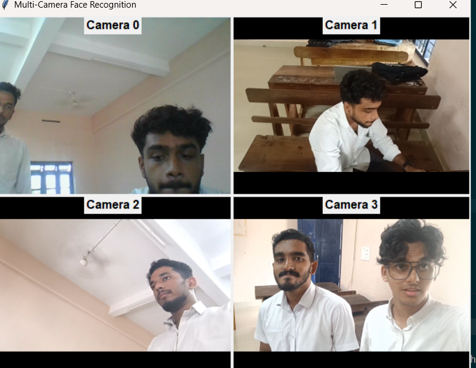
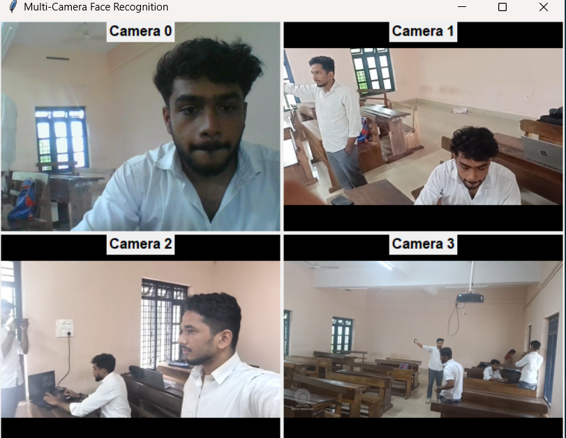
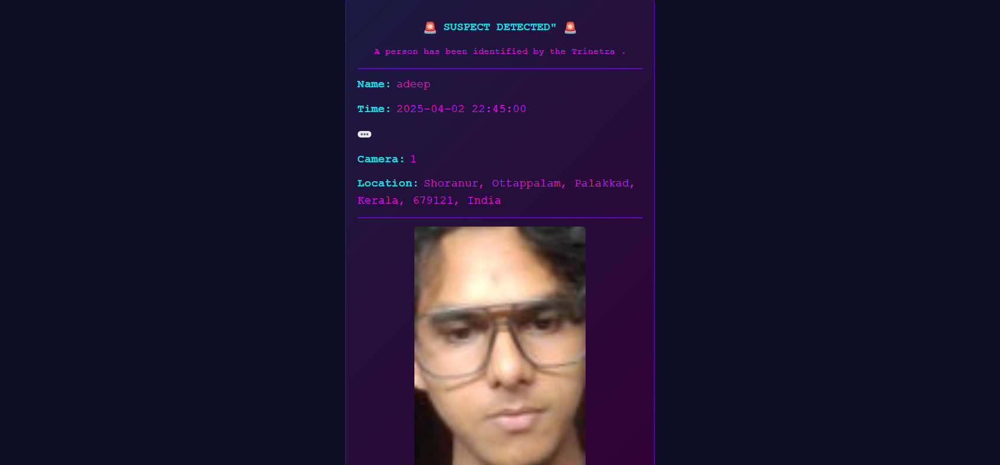

```md
# 🛡️ Trinetra - AI-Powered Face Recognition System  

## **Introduction**  

Trinetra is an **advanced AI-powered face recognition system** designed for **high-precision identity verification** and **real-time surveillance**.  
- Recognizes **only authorized individuals**  
- Ensures **zero false positives**  
- Processes multiple camera feeds with **lag-free performance**  

Trinetra is built from scratch, leveraging **Siamese Neural Networks (SNN)** to enhance accuracy through a **two-step verification process**.  

---

## **System Architecture**  

Trinetra follows a **three-tier architecture**:  

1️⃣ **Dataset Generation Module** – Captures and augments facial data.  
2️⃣ **Training Engine** – Uses **Siamese Neural Networks** for two-step verification.  
3️⃣ **Surveillance & Alert System** – Multi-camera real-time tracking with email alerts.  

---

## **Understanding Siamese Neural Networks (SNN) in Trinetra**  

A **Siamese Neural Network (SNN)** is a deep learning model designed for **one-shot learning** and verification.  

### **How It Works in Trinetra:**  
- The SNN takes **two images** as input (a reference image and a captured image).  
- It extracts **deep feature embeddings** from both images.  
- A **distance metric** (e.g., Euclidean distance) determines their similarity.  
- If the difference is **below a threshold**, the person is verified.  

### **Advantages of Using SNN in Trinetra:**  
👉 **High accuracy** – Learns differences, not just classifications.  
👉 **Zero false positives** – Only verifies trained individuals.  
👉 **Real-time processing** – Optimized for speed and efficiency.  

---

## **Hardware & Software Requirements**  

### **Hardware**  
- **CPU:** Intel i5 or higher  
- **RAM:** 4GB or more  
- **Storage:** Minimum 10GB free space  
- **Camera:** Any high-resolution webcam or IP camera  
- **Additional:** GPS module for location mapping  

### **Software**  
- **Operating System:** Windows / Linux / macOS  
- **Database Server:** MySQL / PostgreSQL  
- **Backend:** Python (Flask/Django)  
- **Frontend:** ReactJS / NextJS  
- **AI/ML Frameworks:** OpenCV, TensorFlow / PyTorch  
- **Messaging:** SMTP for email alerts  

---

## **Project Execution Order**  

### 🏢 **Step 1: Install Dependencies**  
Run the following command to install all required Python packages:  
```bash
pip install -r requirements.txt
```

### 📸 **Step 2: Dataset Generation**  
Run the dataset generation script to capture and augment facial data:  
```bash
python generate_dataset.py
```

### 🏋️‍♂️ **Step 3: Model Training**  
Train the custom-built **Siamese Neural Network (SNN)** for verification:  
```bash
python train_model.py
```

### 🎥 **Step 4: Start Surveillance**  
Launch the multi-camera surveillance system:  
```bash
python surveillance.py
```

### 📩 **Step 5: Alerts & Notifications**  
Trinetra automatically sends email alerts when a recognized person is detected.  

---

## **Outputs & Results**  


### **LOGIN SCREEN**  
  
🔹 **  

### **HOME SCREEN**  
  
🔹 **  

### **GENERATE DATASET**  
  
🔹 *Comparison of input and reference images with confidence scores.*  

### **SURVIALENCE**  
  
🔹  

### **CAMERA FEEDS**  
  
🔹  
  
🔹  
### **ALERT**  
.  
🔹  

---

## **Developed By: TRINETRA TEAM**  


🚀 **Ready to take your security to the next level? Start using Trinetra today!**  

